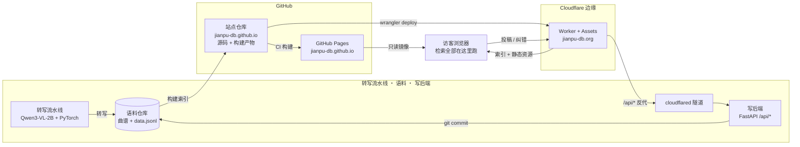

# jianpu-db · 简谱旋律查歌

这是[jianpu-db](https://github.com/Francium-223/jianpu-db)的前端。

[](https://jianpu-db.org/) [](https://jianpu-db.org/) [](https://jianpu-db.org/) [](https://jianpu-db.org/) [](https://jianpu-db.org/) [](https://jianpu-db.org/) [](https://jianpu-db.org/)

**线上**：https://jianpu-db.org/（正式站，可投稿） · https://jianpu-db.github.io/（只读镜像）

---

## 三个位置的关系



| 位置 | 是什么 | 承担什么 |
|---|---|---|
| **本机** | 语料仓库 + 转写流水线（Qwen3-VL-2B / PyTorch）+ FastAPI 写后端 | 生产曲谱；受理投稿并写回语料 |
| **GitHub** | 站点仓库 `jianpu-db.github.io`（前端源码 + 构建产物）；同一仓库用 Pages 发布 | 源码托管；提供**只读镜像**入口 |
| **Cloudflare** | Worker + Assets 承载 **jianpu-db.org** | 正式站：静态资源、每谱 meta 注入、`/api/*` 反向代理 |

**读路径**：扫描件 →（本机转写）→ 语料 →（构建）→ 索引 → 站点仓库 → 边缘 / CDN → **浏览器内检索**。
**写路径**：浏览器 → 边缘反代（`X-Token`）→ 本机服务 → 语料仓库（`git commit`）。

## 这是什么

一份简谱语料，加一个按旋律找歌的检索站。曲谱由视觉语言模型（Qwen3-VL-2B）从扫描件转写而来。
输入你记得的几个音，比如 `5 5 6 5 3 2 1`，它从全库 11,876 首里按代价排序给出候选。

部署（域名 / 边缘 / 隧道 / 写后端）见 [DEPLOY.md](DEPLOY.md)。

## 技术栈（一句话）

TypeScript 前端（零运行时依赖，检索全部在浏览器内完成）+ Cloudflare Workers 边缘 + FastAPI 写后端
+ Python / Qwen3-VL 转写流水线；语料为纯文本曲谱与 JSONL 索引，由 git 版本化。

## 本地跑

```bash
# 站点（只读预览 + 可写回，端口 8770）
py -3.13 app/server.py 8770        # 需要 Python 3.10+；服务本身只用标准库

# 静态预览（构建产物）
node tools/build_dist.mjs --target gh --out dist-gh
tools\serve_local.cmd 8899 gh

# 自检
node tools/check_ui.mjs && node tools/check_search.mjs && node tools/check_live.mjs
node tools/bench_search.mjs 40      # 量索引构建与查询延迟
```

写路径与语料在另外两个仓库：语料 `Francium-223/jianpu-db`、流水线工具 `jianpu2`。

## 只读 Web Service（MusicBrainz 风格，`/ws/2/`）

2026-10-05 加。形状照 [MusicBrainz 的 `/ws/2/`](https://musicbrainz.org/doc/MusicBrainz_API)：
实体 + `inc=` + `fmt=` + `limit/offset` + `{"created","count","offset",…}` 信封 + 每 IP 每秒 1 次
+ 建议带 User-Agent。第三方工具照着这个形状接，几乎不用读文档。

**只有 `song` 一个实体**，主键就是语料里的 `source`（如 `qupu123-268596`），
也接受 `scores/` 里的文件名主干（如 `水手`）。

| 端点 | 说明 |
|---|---|
| `GET /ws/2/` | API 根：实体、参数、限流、一条可点的示例地址 |
| `GET /ws/2/song/<id>?fmt=json&inc=…` | 单条实体（**直接返回对象，不套信封**） |
| `GET /ws/2/song?query=<旋律>&limit=&offset=&fmt=json` | 检索（内部调现成的 matcher） |

```bash
# API 根
curl -s https://jianpu-db.org/ws/2/ | head -c 300

# 检索：旋律 316316 的前 5 条（query 也可以用 q=）
curl -s 'https://jianpu-db.org/ws/2/song?query=316316&limit=5&fmt=json'

# 单条实体（id 用 source，也可以用文件名主干）
curl -s 'https://jianpu-db.org/ws/2/song/qupu123-268596?fmt=json&inc=artists+tags+links+sections'
```

* **参数**：`query`（旋律数字串，1-7）、`limit`（默认 25，上限 100，超了钳到 100）、
  `offset`（默认 0）、`fmt`（只支持 `json`；不传就是 json，也接受 `Accept: application/json`）、
  `inc`（`artists`、`tags`、`links`、`sections`、`score`，多选用 `+` 或空格；
  **不认识的值忽略**，并在响应头 `X-Unknown-Inc` 里列出来，不会 500）。
* **限流**：**每 IP 每秒 1 次**（照 MusicBrainz 的习惯）。超出回 `503` + `Retry-After: 1`。
  请带上能识别调用方的 `User-Agent`，例如 `jianpu-db/ws2 (+https://jianpu-db.org/ws/2/)`。
* **错误**：一律 `{"error": "…"}`（`400` / `404` / `503`）。
* **信封**：检索回 `{"created": <ISO 时间>, "count": <命中数>, "offset": <偏移>, "songs": [...]}`，
  每条 `song` 里多一个 `match`（代价 `diff`、位置 `pos`、段落等）。
  `count` 是"这次看到多少条"：常见查询下就是精确总命中数（另给 `count_exact: true`）；
  宽查询（全库上千首命中）时给 `count_exact: false`，表示服务只数到窗口那么大 ——
  这样不必为了一个数字把全库物化一遍。
* **边缘缓存**：`jianpu-db.org` 上成功的 `GET` 带 `Cache-Control: public, max-age=60`；
  带 `Retry-After` 的 `503` 一律 `no-store`（一次限流不会被边缘记住）。
* 与 `/api/*` **有意不同**的三处（照 MB，不是笔误）：限流 503 而不是 429、错误体是 `{"error": …}`
  而不是 `{"ok": false, "err": …}`、检索带信封。`/api/search` 与写端点一个字都没改。
* 口径只有一份：`app/search_api.py` 的 `ws2_handle`，标准库版 `app/server.py` 与 FastAPI 版
  `app/api.py` 都调它；自检 `node tools/check_ws2_api.mjs`、跨后端对拍
  `py -3.13 tools/check_parity_legacy_vs_fastapi.py --old … --new …`。

## 许可与出处

曲谱的**页面地址与元数据**来自 qupu123 / jianpu.cn / jianpujia 三个公开站点；
本仓库只保存**自己转写的数字序列**与出处链接，不打包、不外链原扫描件。
