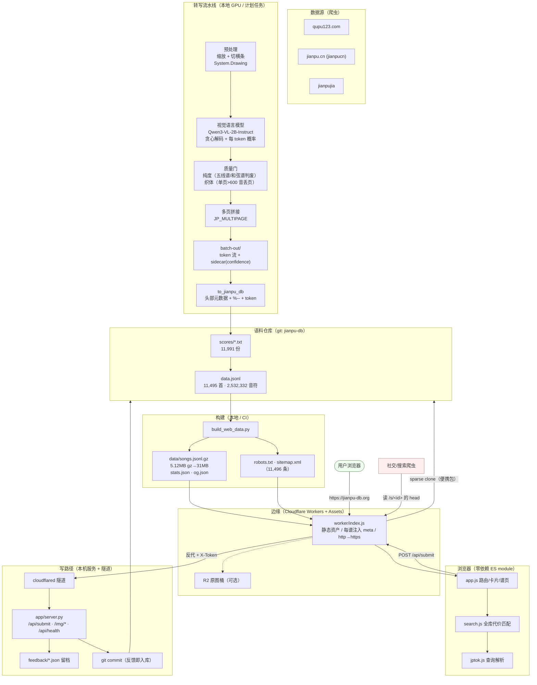

# 架构（jianpu-db）：一份"曲谱 → 可检索语料 → 边缘/浏览器检索 → 写回"的全链路

> 面向面试/评审：每个组件为什么在这儿、数据契约是什么、哪一步是瓶颈。
> 所有数字都是实测（工具：`jianpu2/tools/measure_stack.py`、站点 `tools/bench_search.mjs`）。

## 一、总览



（GitHub 会直接渲染上面的 mermaid；本地看用 VS Code Markdown 预览。）

## 二、组件职责（一句话版）

| 组件 | 职责 | 关键实现 |
|---|---|---|
| 爬虫 | 抓原谱站的谱页图片 + 页面元数据（歌手/分类） | `urllib` + 自写 `tlsfetch.py`（证书过期时**只对出问题的 host** 关校验） |
| 预处理 | 把长条谱切成一页页、缩放 | `tools/preprocess.ps1`（.NET `System.Drawing`） |
| 转写 | 图 → 简谱数字 token 流 | **Qwen3-VL-2B-Instruct**，`generate(do_sample=False)` + `output_scores=True` |
| 质量门 | 挡掉五线谱/和弦谱/钢琴织体 | 纯度分类器 + 织体判据（单页 >600 音丢页；整份每页中位 >400 音跳过） |
| 多页拼接 | 一份谱多张图 → 一份稿 | `JP_MULTIPAGE=1`，页数上限 `JP_MULTIPAGE_MAX=4` |
| 成品化 | token 流 → 带头部元数据的曲谱文件 | `to_jianpu_db.py`（复用旧成品里的拍号/人工标记/composer→mbid 缓存） |
| 索引 | 曲谱 → 检索索引 + 分享卡索引 | `build_web_data.py` → `songs.jsonl.gz` / `stats.json` / `og.json` / `sitemap.xml`；前端 `tsc` 类型检查 + esbuild 擦除后按内容哈希发布 |
| 边缘 | 静态资产、每谱注入、原图、反向代理写请求；**缺失资源一律 404**（SPA 兜底只对页面路由生效 —— 见 `TECH_STACK.md` 的 STAR 14） | Cloudflare Workers（V8 isolates）+ Workers Assets（`run_worker_first`） |
| 前端 | 检索/卡片/谱页/深链，**全部在浏览器里跑** | TypeScript（**零运行时依赖**的 ES module；esbuild 只做类型擦除、不打包）；`tsc` 三份配置：前端核心 strict、主界面过渡（DOM 胶水层待收紧）、Worker strict |
| 写服务 | 校验 → 改曲谱 → `git commit` → 触发重建 | **两份实现、一份口径**：`app/api.py`（FastAPI + Pydantic v2，主力，`/docs` 自动文档）与 `app/server.py`（标准库版，零依赖，随时可退回）；经隧道暴露，`X-Token` 鉴权；切换前用对拍矩阵逐项验证 |
| 语料仓库 | 唯一真源（曲谱 + 索引 + 留档） | git（CI 重建 + Pages 发布） |

## 三、数据契约

### 3.1 曲谱文件（`scores/*.txt`）——人可读、可 diff

```
%曲名.txt
title=曲名
tag=派生标签（由 usertag + tags.json 推出，不手写）
usertag=人工标签（逗号分隔）
artist=歌手
status=ok|ocr            # ok = 人工校对过；ocr = 机器转写
source=qupu123-396822    # 站点-id，用来回溯原页
confidence=0.976         # 转写置信度（每数字 top-1 概率均值）
conf_p10=0.921           # 最低 10% 的分位（个别音很虚时靠它发现）
link=https://…           # 人工核对过的收录页（搜索页会被拒收）
%--
4/4                      # 拍号
<简谱 token 流>
%END
```

> 设计取舍：**纯文本 + 一行一个字段**，`git diff` 人眼可读；元数据与正文用 `%--` 分开，
> 下游解析只需按 token 切分，不引入任何二进制/数据库依赖。

### 3.2 检索索引（`data/songs.jsonl.gz`）——一行一首

| 字段 | 含义 |
|---|---|
| `id` / `s` | 曲谱标识（`<站>-<站内id>`），也是深链 `/s/<id>` |
| `t` / `g` | 曲名 / 归一化分组键（同名多版本归组） |
| `p` / `a` / `o` | 音高序列（数字）/ 变音记号 / 八度标记（**八度不参与检索**，只用于展示） |
| `bars` / `bpb` | 显式小节线（音符下标）/ 拍号（全库 **552,836** 条小节线） |
| `sc` | 段落表（`起始下标:段落名`），用于"副歌优先"的段落权重 |
| `n` / `hot` | 音符数 / 人气代理（该曲歌手/标签在语料里的谱数） |
| `conf` / `confP10` | 置信度（低置信度的结果会被降权/提示） |
| `src` | 原谱原文（verbatim），谱页展示用 |
| `mbid` / `links` / `srcurl` | MusicBrainz work、人工收录页、原站页面 |

实测：5.12 MB gz → 31.01 MB 明文（6.1×），浏览器 gzip 解压 **56 ms** + 建索引 **148 ms**。

### 3.3 写接口（`POST /api/submit`）——四种载荷

| `kind` | 载荷 | 服务端行为 |
|---|---|---|
| `tags` | `{file, tags:[…]}` | 写 `usertag=` → 由 `tags.json` 派生 `tag=` |
| `attr` | `{file, attr, value}` | 只接受 schema 里 `editable` 的属性（artist/alias/MBID/link） |
| `link` | `{file, url}` | 校验"必须是具体收录页"（搜索页直接 400） |
| `submit`/`fix`/`meta` | `{title, score, note, contact, file}` | 投稿/纠错：留档 + （有数字时）直接生成曲谱入库 |

统一返回 `{ok, id, state, committed, refresh, refresh_msg}`；`/api/health` 另外暴露
`token_required`、`upstream`、`og`（分享卡索引条数 —— 用它一眼看出"每谱注入是不是还活着"）。

**纯边缘、不经本机后端的两个只读接口**（它们排在通用代理**之前**处理，所以本机服务停着也照样可用）：

| 路径 | 返回 | 缓存 |
|---|---|---|
| `/api/gh`（别名 `/api/stars`） | `{ok, repo, stars, err, cached}` —— GitHub Star 数 | 成功 **1 小时**；失败只 5 分钟 |
| 为什么放服务端 | GitHub API 对未认证请求按**来源 IP** 限流 60 次/小时 → 放前端等于每个访客各打一次，人多就 403 | 两层：isolate 内存（`cached:"mem"`）+ 边缘（`cf.cacheTtl`，`cached:"edge"`） |

## 四、部署拓扑（两份产物、三种运行位置）

| 位置 | 是什么 | 能力 |
|---|---|---|
| **`https://jianpu-db.org/`** | Cloudflare Worker（正式站） | 检索/卡片/谱页 + **投稿/补属性/补标签**（写路径）+ 每谱注入 |
| `https://jianpu-db.github.io/` | GitHub Pages（只读镜像） | 只读；写操作提示"去正式站" |
| `http://127.0.0.1:8770/` | 本机写后端（**FastAPI 版**） | 开发/内网；**唯一真正写盘 + git commit 的地方**；`/docs` 有交互式接口文档；退回标准库版: `py -3.13 app/server.py 8770` |
| 便携包 `jianpu-server/` | 同一份服务的可搬走版本 | 换台电脑：Python + （可选）cloudflared 即可 |
| **容器** `docker compose up -d api` | 一条命令起写后端（`--profile tunnel` 连隧道一起） | 语料**挂卷**（投稿要 `git commit` 到真仓库）；镜像构建在 CI 的 `docker` job 里验证 |

关键点：
* **`assets.run_worker_first`** 必须设 —— 否则 `/s/<id>` 这种"靠 SPA 回退"的请求在资源层就被接走，
  Worker 不被调用（每谱注入静默失效，页面却照常打开）。
* **写路径不落边缘**：Worker 只做反代 + 注入 `X-Token`；真正写盘/提交在作者本机（`cloudflared` 隧道出去），
  这样"数据库/仓库在本地"与"边缘读性能"两件事不互相牵制。

## 五、瓶颈与下一步（面试常问"哪里慢/怎么扩"）

| 环节 | 实测 | 瓶颈性质 | 计划 |
|---|---|---|---|
| 转写 | 每份中位 38–61 s（59–95 份/小时） | GPU 单卡、模型串行 | 批处理/并行多进程；只在新增量上跑（幂等台账 + `--rescue`） |
| 浏览器检索 | 索引就绪 ~200 ms（ngram 倒排另在**空闲时**建 ~136 ms）；查询中位 **~106 ms** | 结果排序的固定开销 + 全库代价匹配 | 已做: ① **排序键预计算**（144.6 → 105.9 ms，-27%）；② **ngram 剪枝**（`ensureGrams`；只对"每段都精确命中"的查询走，长查询 **69.1 → 48.2 ms/条（-30%）**，结果逐条相同；短查询/模糊查询退回全扫，等于没变化）。试过并**否决**: Rust→Wasm 内层循环（逐首对拍一致，但端到端 0.84×） |
| 索引下发 | 5.12 MB gz | 每次打开页面一次 | 拆冷热索引、PWA Cache Storage 常驻 |
| 写路径 | 依赖隧道与开机 | 本机在线才有写能力 | 可选上云（R2/D1）或改成"队列 + 稍后入库" |
| 观测 | `/api/health` + `/metrics` | 读路径指标在 Cloudflare 侧（分析面板/Worker 指标），写路径指标在 `/metrics`（Prometheus 文本格式，可被任意 Prometheus/Grafana 抓） | 把"上游死活"做成告警规则（`upstreamOk`）、把投稿漏斗做成面板 |
